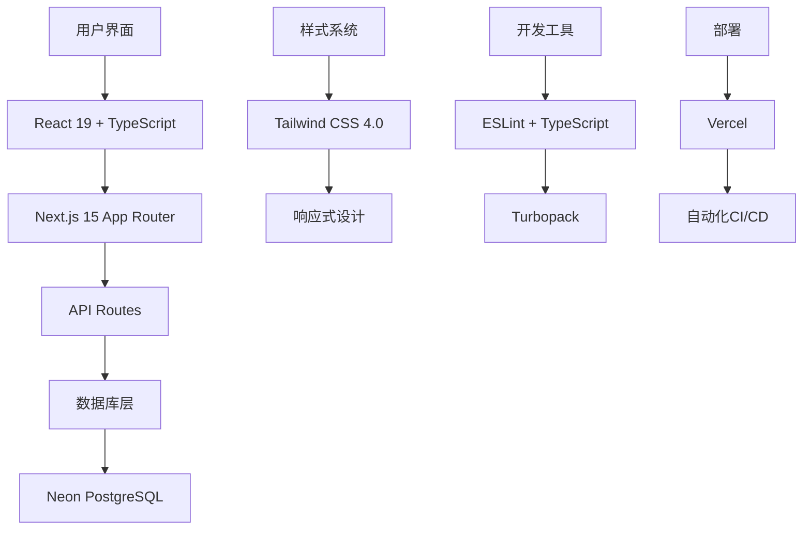
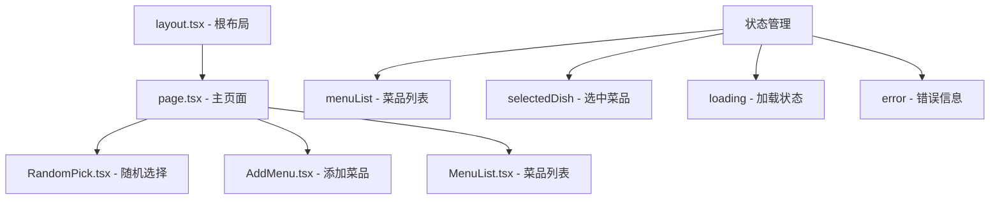
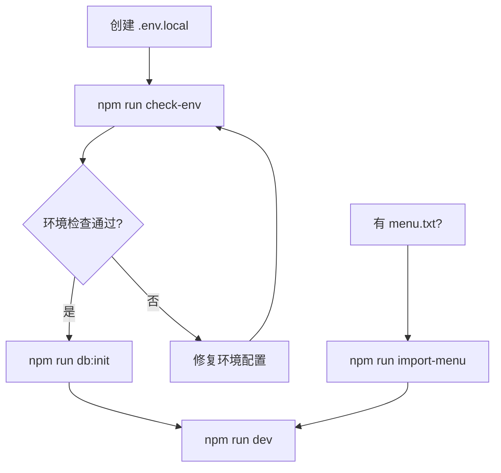
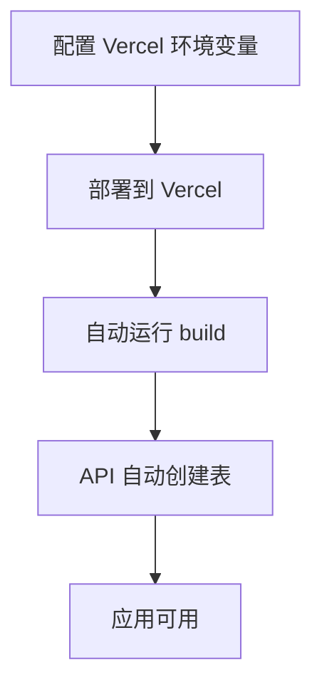
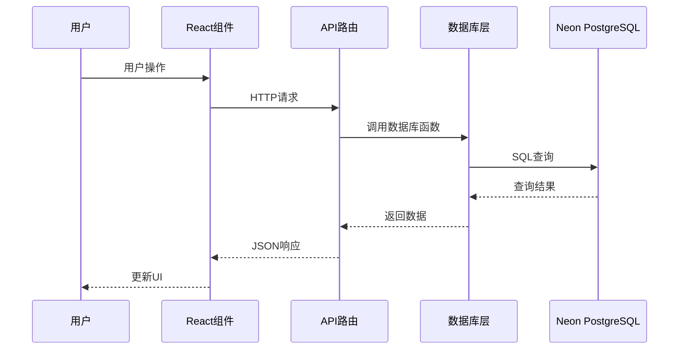
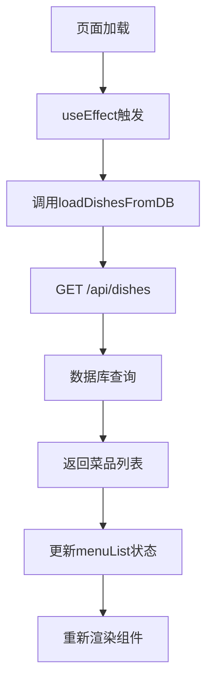
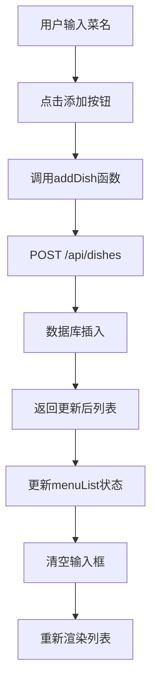
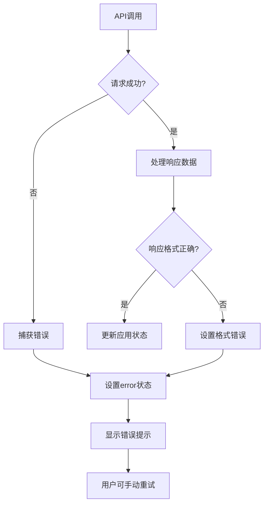

# 项目架构详细文档

本文档详细介绍了"今天吃什么"项目的完整架构，包括项目结构、核心组件、重要函数和配置文件，方便学习和维护。

## 📋 目录

- [🏗️ 项目概览](#️-项目概览)
- [📁 项目结构详解](#-项目结构详解)
- [⚙️ 配置文件详解](#️-配置文件详解)
- [🧩 核心组件架构](#-核心组件架构)
- [🗄️ 数据库层架构](#️-数据库层架构)
- [🌐 API 路由架构](#-api-路由架构)
- [📜 脚本文件详解](#-脚本文件详解)
- [🔄 数据流架构](#-数据流架构)
- [🎨 样式架构](#-样式架构)
- [📦 依赖管理](#-依赖管理)

---

## 🏗️ 项目概览

### 技术栈架构



### 架构特点

- **🎯 单页应用 (SPA)**: 基于 React 的客户端渲染
- **🔄 全栈框架**: Next.js 提供前后端一体化解决方案
- **📱 响应式设计**: 移动优先的设计理念
- **🛡️ 类型安全**: 全面使用 TypeScript
- **⚡ 性能优化**: Turbopack 极速构建
- **🗄️ 数据持久化**: PostgreSQL 数据库存储

---

## 📁 项目结构详解

### 完整目录树

```
what-to-eat-app/
├── 📁 public/                    # 静态资源目录
│   ├── 🖼️ file.svg              # 文件图标
│   ├── 🌐 globe.svg             # 地球图标
│   ├── ⚡ next.svg              # Next.js 图标
│   ├── 🔺 vercel.svg            # Vercel 图标
│   └── 🪟 window.svg            # 窗口图标
├── 📁 src/                       # 源代码目录
│   ├── 📁 app/                   # Next.js App Router 目录
│   │   ├── 📁 api/               # API 路由目录
│   │   │   └── 📁 dishes/        # 菜品相关 API
│   │   │       └── 📄 route.ts   # RESTful API 实现
│   │   ├── 🎨 globals.css        # 全局样式文件
│   │   ├── 🏠 page.tsx           # 主页面组件
│   │   ├── 📐 layout.tsx         # 根布局组件
│   │   └── 🎯 favicon.ico        # 网站图标
│   ├── 📁 components/            # React 组件目录
│   │   ├── ➕ AddMenu.tsx        # 添加菜品组件
│   │   ├── 📋 MenuList.tsx       # 菜品列表组件
│   │   └── 🎲 RandomPick.tsx     # 随机选择组件
│   └── 📁 lib/                   # 工具库目录
│       └── 🗄️ db.ts              # 数据库操作函数
├── 📁 scripts/                   # 脚本目录
│   ├── 🔧 init-db.js             # 数据库初始化脚本
│   ├── 📥 import-menu.js         # 菜单导入脚本
│   └── ✅ check-env.js           # 环境检查脚本
├── 📁 docs/                      # 文档目录
│   ├── 📖 README.md              # 文档索引
│   ├── 🚀 deployment.md          # 部署指南
│   ├── 🔧 troubleshooting.md     # 故障排除
│   └── 📊 api.md                 # API 文档
├── ⚙️ next.config.ts             # Next.js 配置文件
├── 🔍 eslint.config.mjs          # ESLint 配置文件
├── 🎨 postcss.config.mjs         # PostCSS 配置文件
├── 📝 tsconfig.json              # TypeScript 配置文件
├── 📦 package.json               # 项目依赖和脚本
├── 🔒 package-lock.json          # 依赖锁定文件
├── 🌍 .env.local                 # 环境变量文件（需创建）
├── 🚫 .gitignore                 # Git 忽略文件
├── 📄 README.md                  # 项目说明文档
├── 🐛 issues.md                  # 问题总结文档
└── 📋 structure.md               # 本架构文档
```

### 目录职责说明

#### 📁 `public/` - 静态资源目录
- **作用**: 存放静态文件，可直接通过 URL 访问
- **特点**: 文件会被复制到构建输出目录
- **访问方式**: `https://domain.com/file.svg`

#### 📁 `src/app/` - Next.js App Router 核心
- **作用**: Next.js 15 的新路由系统
- **特点**: 基于文件系统的路由
- **路由规则**:
  - `page.tsx` → 页面组件
  - `layout.tsx` → 布局组件
  - `api/` → API 路由

#### 📁 `src/components/` - React 组件库
- **作用**: 可复用的 React 组件
- **设计原则**: 单一职责、高内聚、低耦合
- **命名规范**: PascalCase，如 `AddMenu.tsx`

#### 📁 `src/lib/` - 工具库
- **作用**: 业务逻辑和工具函数
- **特点**: 与框架无关的纯函数
- **示例**: 数据库操作、工具函数

#### 📁 `scripts/` - 自动化脚本
- **作用**: 项目维护和部署脚本
- **语言**: Node.js JavaScript
- **用途**: 数据库初始化、数据导入等

---

## ⚙️ 配置文件详解

### 📦 `package.json` - 项目配置核心

```json
{
  "name": "what-to-eat-app",
  "version": "0.1.0",
  "private": true,
  "scripts": {
    "dev": "next dev --turbopack",      // 开发服务器 + Turbopack
    "build": "next build",              // 生产构建
    "start": "next start",              // 生产服务器
    "lint": "next lint",                // 代码检查
    "db:init": "node scripts/init-db.js",        // 数据库初始化
    "import-menu": "node scripts/import-menu.js", // 菜单导入
    "check-env": "node scripts/check-env.js"     // 环境检查
  },
  "dependencies": {
    "@neondatabase/serverless": "^1.0.1",  // Neon 数据库驱动
    "next": "15.3.3",                      // Next.js 框架
    "react": "^19.0.0",                    // React 库
    "react-dom": "^19.0.0"                 // React DOM
  },
  "devDependencies": {
    "@eslint/eslintrc": "^3",              // ESLint 配置
    "@tailwindcss/postcss": "^4",          // Tailwind PostCSS
    "@types/node": "^20",                  // Node.js 类型
    "@types/react": "^19",                 // React 类型
    "@types/react-dom": "^19",             // React DOM 类型
    "eslint": "^9",                        // 代码检查工具
    "eslint-config-next": "15.3.3",       // Next.js ESLint 配置
    "tailwindcss": "^4",                   // CSS 框架
    "typescript": "^5"                     // TypeScript 编译器
  }
}
```

#### 脚本命令详解

| 命令 | 作用 | 使用场景 |
|------|------|----------|
| `npm run dev` | 启动开发服务器，启用 Turbopack | 日常开发 |
| `npm run build` | 构建生产版本 | 部署前构建 |
| `npm run start` | 启动生产服务器 | 本地测试生产版本 |
| `npm run lint` | 运行 ESLint 检查 | 代码质量检查 |
| `npm run db:init` | 初始化数据库表结构 | 首次部署 |
| `npm run import-menu` | 从文件导入菜品 | 批量数据导入 |
| `npm run check-env` | 检查环境变量配置 | 环境诊断 |

### 📝 `tsconfig.json` - TypeScript 配置

```json
{
  "compilerOptions": {
    "target": "ES2017",                    // 编译目标
    "lib": ["dom", "dom.iterable", "esnext"], // 包含的库
    "allowJs": true,                       // 允许 JS 文件
    "skipLibCheck": true,                  // 跳过库文件检查
    "strict": true,                        // 严格模式
    "noEmit": true,                        // 不生成文件
    "esModuleInterop": true,               // ES 模块互操作
    "module": "esnext",                    // 模块系统
    "moduleResolution": "bundler",         // 模块解析策略
    "resolveJsonModule": true,             // 解析 JSON 模块
    "isolatedModules": true,               // 隔离模块
    "jsx": "preserve",                     // JSX 处理方式
    "incremental": true,                   // 增量编译
    "plugins": [{ "name": "next" }],       // Next.js 插件
    "paths": { "@/*": ["./src/*"] }        // 路径映射
  },
  "include": ["next-env.d.ts", "**/*.ts", "**/*.tsx", ".next/types/**/*.ts"],
  "exclude": ["node_modules"]
}
```

#### 重要配置说明

- **`strict: true`**: 启用所有严格类型检查
- **`paths: { "@/*": ["./src/*"] }`**: 设置路径别名，`@/` 指向 `src/`
- **`jsx: "preserve"`**: 保留 JSX，由 Next.js 处理
- **`moduleResolution: "bundler"`**: 使用打包器模块解析

### 🔍 `eslint.config.mjs` - 代码质量配置

```javascript
import { dirname } from "path";
import { fileURLToPath } from "url";
import { FlatCompat } from "@eslint/eslintrc";

const __filename = fileURLToPath(import.meta.url);
const __dirname = dirname(__filename);

const compat = new FlatCompat({
  baseDirectory: __dirname,
});

const eslintConfig = [
  ...compat.extends("next/core-web-vitals", "next/typescript"),
];

export default eslintConfig;
```

#### 配置特点

- **ESM 格式**: 使用 ES 模块语法
- **Next.js 集成**: 继承 Next.js 推荐配置
- **TypeScript 支持**: 包含 TypeScript 规则
- **Web Vitals**: 包含性能相关规则

### 🎨 `postcss.config.mjs` - CSS 处理配置

```javascript
const config = {
  plugins: ["@tailwindcss/postcss"],
};

export default config;
```

#### 配置说明

- **Tailwind CSS 集成**: 使用 Tailwind 的 PostCSS 插件
- **简化配置**: Tailwind CSS 4.0 的简化配置方式

### ⚡ `next.config.ts` - Next.js 配置

```typescript
import type { NextConfig } from "next";

const nextConfig: NextConfig = {
  /* config options here */
};

export default nextConfig;
```

#### 配置特点

- **最小配置**: 使用 Next.js 默认配置
- **TypeScript 支持**: 配置文件使用 TypeScript
- **可扩展**: 可根据需要添加配置项

---

## 🧩 核心组件架构

### 组件层次结构



### 🏠 `src/app/page.tsx` - 主页面组件

#### 组件职责
- **状态管理**: 管理应用的全局状态
- **数据流控制**: 协调各子组件间的数据传递
- **API 调用**: 处理与后端的数据交互
- **错误处理**: 统一处理错误状态

#### 核心状态

```typescript
const [menuList, setMenuList] = useState<string[]>([]);     // 菜品列表
const [inputValue, setInputValue] = useState('');          // 输入框值
const [selectedDish, setSelectedDish] = useState('');      // 选中的菜品
const [showResult, setShowResult] = useState(false);       // 是否显示结果
const [loading, setLoading] = useState(false);             // 加载状态
const [error, setError] = useState<string | null>(null);   // 错误信息
```

#### 重要函数

**1. `loadDishesFromDB()` - 从数据库加载菜品**
```typescript
const loadDishesFromDB = async () => {
  try {
    setLoading(true);
    setError(null);
    const response = await fetch('/api/dishes');
    const result = await response.json();

    if (result.success) {
      setMenuList(result.data);
    } else {
      setError(result.error || '加载菜品失败');
    }
  } catch (error) {
    console.error('Error loading dishes:', error);
    setError('网络错误，请检查连接');
  } finally {
    setLoading(false);
  }
};
```

**2. `addDish()` - 添加菜品**
```typescript
const addDish = async () => {
  const trimmedValue = inputValue.trim();
  if (!trimmedValue) return;

  try {
    setLoading(true);
    setError(null);

    const response = await fetch('/api/dishes', {
      method: 'POST',
      headers: { 'Content-Type': 'application/json' },
      body: JSON.stringify({ name: trimmedValue }),
    });

    const result = await response.json();
    if (result.success) {
      setMenuList(result.data);
      setInputValue('');
    } else {
      setError(result.error || '添加菜品失败');
    }
  } catch (error) {
    setError('网络错误，请检查连接');
  } finally {
    setLoading(false);
  }
};
```

**3. `randomPick()` - 随机选择菜品**
```typescript
const randomPick = async () => {
  let currentMenu = menuList;

  // 如果菜单为空，自动添加预设菜品
  if (currentMenu.length === 0) {
    try {
      setLoading(true);
      const response = await fetch('/api/dishes', {
        method: 'POST',
        headers: { 'Content-Type': 'application/json' },
        body: JSON.stringify({ dishes: presetDishes }),
      });

      const result = await response.json();
      if (result.success) {
        currentMenu = result.data;
        setMenuList(currentMenu);
      } else {
        currentMenu = presetDishes;
      }
    } catch (error) {
      currentMenu = presetDishes;
    } finally {
      setLoading(false);
    }
  }

  if (currentMenu.length > 0) {
    const randomIndex = Math.floor(Math.random() * currentMenu.length);
    setSelectedDish(currentMenu[randomIndex]);
    setShowResult(true);
  }
};
```

### 🎲 `src/components/RandomPick.tsx` - 随机选择组件

#### 组件职责
- **随机选择按钮**: 提供主要交互入口
- **结果展示**: 显示选择结果和动画效果
- **分享功能**: 支持原生分享或复制到剪贴板

#### Props 接口

```typescript
interface RandomPickProps {
  menuList: string[];           // 菜品列表
  selectedDish: string;         // 选中的菜品
  showResult: boolean;          // 是否显示结果
  onRandomPick: () => void;     // 随机选择回调
}
```

#### 核心功能

**1. 随机选择按钮**
- 响应式设计，支持多种屏幕尺寸
- 渐变背景和悬停效果
- 动态提示信息

**2. 结果展示区域**
- 动画效果：`animate-in slide-in-from-top`
- 渐变背景和装饰效果
- 响应式字体大小

**3. 分享功能**
```typescript
onClick={() => {
  if (navigator.share) {
    navigator.share({
      title: '今天吃什么',
      text: `今天决定吃：${selectedDish}！`,
    });
  } else {
    navigator.clipboard?.writeText(`今天决定吃：${selectedDish}！`);
  }
}}
```

---

### ➕ `src/components/AddMenu.tsx` - 添加菜品组件

#### 组件职责
- **用户输入**: 提供菜品名称输入框
- **表单验证**: 验证输入内容
- **交互反馈**: 显示加载状态和禁用状态

#### Props 接口

```typescript
interface AddMenuProps {
  inputValue: string;                    // 输入框值
  setInputValue: (value: string) => void; // 设置输入框值
  onAddDish: () => void;                 // 添加菜品回调
  onKeyPress: (e: React.KeyboardEvent) => void; // 键盘事件
  loading?: boolean;                     // 加载状态
}
```

#### 核心功能

**1. 输入框组件**
```typescript
<input
  type="text"
  value={inputValue}
  onChange={(e) => setInputValue(e.target.value)}
  onKeyPress={onKeyPress}
  placeholder="输入菜名..."
  disabled={loading}
  className="flex-1 px-4 py-2 border border-gray-300 rounded-lg focus:outline-none focus:ring-2 focus:ring-orange-500 focus:border-transparent disabled:opacity-50 disabled:cursor-not-allowed"
/>
```

**2. 添加按钮**
- 动态禁用：当输入为空或加载中时禁用
- 加载动画：显示旋转加载图标
- 状态反馈：不同状态下的视觉反馈

### 📋 `src/components/MenuList.tsx` - 菜品列表组件

#### 组件职责
- **列表展示**: 以网格形式展示所有菜品
- **删除功能**: 提供单个菜品删除功能
- **批量操作**: 支持清空所有菜品
- **视觉设计**: 多彩卡片设计和悬停效果

#### Props 接口

```typescript
interface MenuListProps {
  menuList: string[];                    // 菜品列表
  onDeleteDish: (dish: string) => void;  // 删除菜品回调
  onClearAll?: () => void;               // 清空所有回调
}
```

#### 核心功能

**1. 动态颜色系统**
```typescript
const getCardColor = (index: number) => {
  const colors = [
    'from-orange-50 to-red-50 border-orange-200 hover:border-orange-300',
    'from-yellow-50 to-orange-50 border-yellow-200 hover:border-yellow-300',
    'from-red-50 to-pink-50 border-red-200 hover:border-red-300',
    // ... 更多颜色
  ];
  return colors[index % colors.length];
};
```

**2. 响应式网格布局**
```css
grid-cols-2 sm:grid-cols-3 md:grid-cols-4 lg:grid-cols-5 xl:grid-cols-6
```

**3. 交互效果**
- 悬停缩放：`hover:scale-105`
- 上浮效果：`hover:-translate-y-1`
- 删除按钮：悬停时显示

### 📐 `src/app/layout.tsx` - 根布局组件

#### 组件职责
- **全局布局**: 定义应用的基础HTML结构
- **字体配置**: 配置 Google Fonts
- **元数据**: 设置页面标题和描述
- **全局样式**: 引入全局CSS

#### 核心配置

**1. 字体配置**
```typescript
const geistSans = Geist({
  variable: "--font-geist-sans",
  subsets: ["latin"],
});

const geistMono = Geist_Mono({
  variable: "--font-geist-mono",
  subsets: ["latin"],
});
```

**2. 元数据配置**
```typescript
export const metadata: Metadata = {
  title: "Create Next App",
  description: "Generated by create next app",
};
```

**3. HTML 结构**
```typescript
return (
  <html lang="en">
    <body className={`${geistSans.variable} ${geistMono.variable} antialiased`}>
      {children}
    </body>
  </html>
);
```

---

## 🗄️ 数据库层架构

### 数据库连接配置

#### 连接初始化
```typescript
import { neon } from '@neondatabase/serverless';

// 支持多种环境变量名
const databaseUrl = process.env.NEON_URL || process.env.DATABASE_URL;
if (!databaseUrl) {
  throw new Error('Database URL not found. Please set NEON_URL or DATABASE_URL environment variable.');
}
const sql = neon(databaseUrl);
```

#### 环境变量优先级
1. **`NEON_URL`** - 优先使用
2. **`DATABASE_URL`** - 备用选项

### 数据模型设计

#### Dish 接口定义
```typescript
export interface Dish {
  id: number;           // 主键，自增
  name: string;         // 菜品名称，唯一
  created_at: string;   // 创建时间
}
```

#### 数据库表结构
```sql
CREATE TABLE dishes (
  id SERIAL PRIMARY KEY,                    -- 自增主键
  name TEXT NOT NULL UNIQUE,                -- 菜品名称，不能重复
  created_at TIMESTAMP DEFAULT CURRENT_TIMESTAMP  -- 创建时间
);
```

### 核心数据库函数

#### 1. `createDishesTable()` - 创建表
```typescript
export async function createDishesTable() {
  try {
    await sql`
      CREATE TABLE IF NOT EXISTS dishes (
        id SERIAL PRIMARY KEY,
        name TEXT NOT NULL UNIQUE,
        created_at TIMESTAMP DEFAULT CURRENT_TIMESTAMP
      )
    `;
    console.log('Dishes table created or already exists');
  } catch (error) {
    console.error('Error creating dishes table:', error);
    throw error;
  }
}
```

#### 2. `getAllDishes()` - 获取所有菜品
```typescript
export async function getAllDishes(): Promise<Dish[]> {
  try {
    const dishes = await sql`
      SELECT id, name, created_at
      FROM dishes
      ORDER BY created_at DESC
    `;
    return dishes as Dish[];
  } catch (error) {
    console.error('Error fetching dishes:', error);
    throw error;
  }
}
```

#### 3. `addDish()` - 添加单个菜品
```typescript
export async function addDish(name: string): Promise<Dish> {
  try {
    const trimmedName = name.trim();
    if (!trimmedName) {
      throw new Error('菜品名称不能为空');
    }

    const result = await sql`
      INSERT INTO dishes (name)
      VALUES (${trimmedName})
      RETURNING id, name, created_at
    `;

    if (result.length === 0) {
      throw new Error('添加菜品失败');
    }

    return result[0] as Dish;
  } catch (error: unknown) {
    if (error instanceof Error && error.message?.includes('duplicate key')) {
      throw new Error('该菜品已存在');
    }
    console.error('Error adding dish:', error);
    throw error;
  }
}
```

#### 4. `addMultipleDishes()` - 批量添加菜品
```typescript
export async function addMultipleDishes(dishes: string[]): Promise<Dish[]> {
  const addedDishes: Dish[] = [];

  for (const dishName of dishes) {
    try {
      const dish = await addDish(dishName);
      addedDishes.push(dish);
    } catch (error) {
      // 忽略重复菜品错误，继续添加其他菜品
      if (error instanceof Error && error.message.includes('已存在')) {
        console.log(`菜品 "${dishName}" 已存在，跳过`);
      } else {
        console.error(`添加菜品 "${dishName}" 失败:`, error);
      }
    }
  }

  return addedDishes;
}
```

#### 5. `deleteDishByName()` - 删除菜品
```typescript
export async function deleteDishByName(name: string): Promise<void> {
  try {
    const result = await sql`
      DELETE FROM dishes
      WHERE name = ${name}
    `;

    if (result.count === 0) {
      throw new Error('菜品不存在');
    }
  } catch (error) {
    console.error('Error deleting dish:', error);
    throw error;
  }
}
```

#### 6. `clearAllDishes()` - 清空所有菜品
```typescript
export async function clearAllDishes(): Promise<void> {
  try {
    await sql`DELETE FROM dishes`;
  } catch (error) {
    console.error('Error clearing all dishes:', error);
    throw error;
  }
}
```

#### 7. `getRandomDish()` - 随机获取菜品
```typescript
export async function getRandomDish(): Promise<Dish | null> {
  try {
    const result = await sql`
      SELECT id, name, created_at
      FROM dishes
      ORDER BY RANDOM()
      LIMIT 1
    `;

    return result.length > 0 ? result[0] as Dish : null;
  } catch (error) {
    console.error('Error getting random dish:', error);
    throw error;
  }
}
```

### 错误处理策略

#### 1. 数据库连接错误
- 检查环境变量配置
- 验证网络连接
- 重试机制

#### 2. 数据完整性错误
- 唯一约束冲突处理
- 空值检查
- 数据格式验证

#### 3. 性能优化
- 使用索引优化查询
- 批量操作减少数据库调用
- 连接池管理

---

## 🌐 API 路由架构

### RESTful API 设计

#### 路由结构
```
/api/dishes
├── GET     - 获取所有菜品
├── POST    - 添加菜品（单个或批量）
└── DELETE  - 删除菜品（单个或全部）
```

### `src/app/api/dishes/route.ts` - API 路由实现

#### 路由文件结构
```typescript
import { NextRequest, NextResponse } from 'next/server';
import {
  getAllDishes,
  addDish,
  deleteDishByName,
  clearAllDishes,
  addMultipleDishes,
  createDishesTable
} from '@/lib/db';
```

#### 核心函数详解

**1. `ensureTableExists()` - 确保表存在**
```typescript
async function ensureTableExists() {
  try {
    await createDishesTable();
  } catch (error) {
    console.error('Error ensuring table exists:', error);
  }
}
```

**2. `GET` - 获取所有菜品**
```typescript
export async function GET() {
  try {
    // 检查环境变量
    const databaseUrl = process.env.NEON_URL || process.env.DATABASE_URL;
    if (!databaseUrl) {
      console.error('Database URL environment variable is not set');
      return NextResponse.json(
        { success: false, error: 'Database configuration error' },
        { status: 500 }
      );
    }

    await ensureTableExists();
    const dishes = await getAllDishes();
    return NextResponse.json({
      success: true,
      data: dishes.map(dish => dish.name) // 返回菜品名称数组
    });
  } catch (error) {
    console.error('Error in GET /api/dishes:', error);
    return NextResponse.json(
      { success: false, error: 'Failed to fetch dishes' },
      { status: 500 }
    );
  }
}
```

**3. `POST` - 添加菜品**
```typescript
export async function POST(request: NextRequest) {
  try {
    await ensureTableExists();
    const body = await request.json();
    const { name, dishes } = body;

    if (dishes && Array.isArray(dishes)) {
      // 批量添加菜品
      const addedDishes = await addMultipleDishes(dishes);
      const allDishes = await getAllDishes();
      return NextResponse.json({
        success: true,
        data: allDishes.map(dish => dish.name),
        message: `成功添加 ${addedDishes.length} 道菜品`
      });
    } else if (name) {
      // 添加单个菜品
      await addDish(name);
      const allDishes = await getAllDishes();
      return NextResponse.json({
        success: true,
        data: allDishes.map(dish => dish.name),
        message: '菜品添加成功'
      });
    } else {
      return NextResponse.json(
        { success: false, error: '请提供菜品名称' },
        { status: 400 }
      );
    }
  } catch (error: unknown) {
    console.error('Error in POST /api/dishes:', error);
    const errorMessage = error instanceof Error ? error.message : 'Unknown error';
    return NextResponse.json(
      { success: false, error: errorMessage },
      { status: 500 }
    );
  }
}
```

**4. `DELETE` - 删除菜品**
```typescript
export async function DELETE(request: NextRequest) {
  try {
    await ensureTableExists();
    const body = await request.json();
    const { name, clearAll } = body;

    if (clearAll) {
      // 清空所有菜品
      await clearAllDishes();
      return NextResponse.json({
        success: true,
        data: [],
        message: '所有菜品已清空'
      });
    } else if (name) {
      // 删除指定菜品
      await deleteDishByName(name);
      const allDishes = await getAllDishes();
      return NextResponse.json({
        success: true,
        data: allDishes.map(dish => dish.name),
        message: '菜品删除成功'
      });
    } else {
      return NextResponse.json(
        { success: false, error: '请提供要删除的菜品名称或设置clearAll为true' },
        { status: 400 }
      );
    }
  } catch (error: unknown) {
    console.error('Error in DELETE /api/dishes:', error);
    const errorMessage = error instanceof Error ? error.message : 'Unknown error';
    return NextResponse.json(
      { success: false, error: errorMessage },
      { status: 500 }
    );
  }
}
```

### API 请求/响应格式

#### 请求格式

**1. 添加单个菜品**
```json
POST /api/dishes
{
  "name": "红烧肉"
}
```

**2. 批量添加菜品**
```json
POST /api/dishes
{
  "dishes": ["红烧肉", "糖醋排骨", "宫保鸡丁"]
}
```

**3. 删除单个菜品**
```json
DELETE /api/dishes
{
  "name": "红烧肉"
}
```

**4. 清空所有菜品**
```json
DELETE /api/dishes
{
  "clearAll": true
}
```

#### 响应格式

**成功响应**
```json
{
  "success": true,
  "data": ["红烧肉", "糖醋排骨", "宫保鸡丁"],
  "message": "操作成功"
}
```

**错误响应**
```json
{
  "success": false,
  "error": "错误信息"
}
```

### 错误处理机制

#### 1. 环境变量检查
- 检查数据库连接字符串
- 返回配置错误信息

#### 2. 数据验证
- 验证请求体格式
- 检查必需字段

#### 3. 数据库错误处理
- 捕获数据库操作异常
- 返回友好的错误信息

#### 4. 统一错误响应
- 标准化错误响应格式
- 记录详细错误日志

---

## 📜 脚本文件详解

### 🔧 `scripts/init-db.js` - 数据库初始化脚本

#### 脚本职责
- **环境变量加载**: 手动解析 `.env.local` 文件
- **数据库连接**: 建立与 Neon PostgreSQL 的连接
- **表结构创建**: 创建 `dishes` 表
- **示例数据**: 添加初始示例菜品

#### 核心函数

**1. `loadEnvFile()` - 环境变量加载**
```javascript
function loadEnvFile() {
  const envPath = path.join(__dirname, '..', '.env.local');
  if (fs.existsSync(envPath)) {
    const envContent = fs.readFileSync(envPath, 'utf8');
    const lines = envContent.split('\n');

    for (const line of lines) {
      const trimmedLine = line.trim();
      if (trimmedLine && !trimmedLine.startsWith('#')) {
        const [key, ...valueParts] = trimmedLine.split('=');
        if (key && valueParts.length > 0) {
          process.env[key.trim()] = valueParts.join('=').trim();
        }
      }
    }
  }
}
```

**2. `initDatabase()` - 主初始化函数**
```javascript
async function initDatabase() {
  try {
    // 加载环境变量
    loadEnvFile();

    // 从环境变量获取数据库连接
    const sql = neon(process.env.DATABASE_URL);

    console.log('正在连接数据库...');

    // 创建菜品表
    await sql`
      CREATE TABLE IF NOT EXISTS dishes (
        id SERIAL PRIMARY KEY,
        name TEXT NOT NULL UNIQUE,
        created_at TIMESTAMP DEFAULT CURRENT_TIMESTAMP
      )
    `;

    console.log('✅ 菜品表创建成功');

    // 检查表是否为空，如果为空则添加示例数据
    const count = await sql`SELECT COUNT(*) as count FROM dishes`;
    const dishCount = parseInt(count[0].count);

    if (dishCount === 0) {
      console.log('正在添加示例菜品...');

      const sampleDishes = [
        '红烧肉', '糖醋排骨', '宫保鸡丁', '鱼香肉丝', '麻婆豆腐',
        '回锅肉', '青椒肉丝', '蒜泥白肉', '水煮鱼', '口水鸡'
      ];

      for (const dish of sampleDishes) {
        try {
          await sql`INSERT INTO dishes (name) VALUES (${dish})`;
          console.log(`✅ 添加菜品: ${dish}`);
        } catch (error) {
          console.log(`⚠️  菜品 ${dish} 已存在，跳过`);
        }
      }
    } else {
      console.log(`📊 数据库中已有 ${dishCount} 道菜品`);
    }

    console.log('🎉 数据库初始化完成！');

  } catch (error) {
    console.error('❌ 数据库初始化失败:', error);
    process.exit(1);
  }
}
```

#### 使用方法
```bash
npm run db:init
```

### 📥 `scripts/import-menu.js` - 菜单导入脚本

#### 脚本职责
- **文件解析**: 解析 `menu.txt` 文件
- **数据清理**: 去重和格式化菜品名称
- **批量导入**: 将菜品批量添加到数据库
- **进度显示**: 显示导入进度和结果

#### 核心函数

**1. `parseMenuFile()` - 解析菜单文件**
```javascript
function parseMenuFile() {
  const menuPath = path.join(__dirname, '..', 'menu.txt');

  if (!fs.existsSync(menuPath)) {
    throw new Error('menu.txt 文件不存在');
  }

  const content = fs.readFileSync(menuPath, 'utf8');
  const lines = content.split('\n');

  const dishes = [];
  const seen = new Set();

  for (const line of lines) {
    const trimmed = line.trim();
    if (trimmed && !seen.has(trimmed)) {
      dishes.push(trimmed);
      seen.add(trimmed);
    }
  }

  return dishes;
}
```

**2. `addDishesToDatabase()` - 批量添加到数据库**
```javascript
async function addDishesToDatabase(dishes) {
  const sql = neon(process.env.DATABASE_URL);
  let addedCount = 0;
  let skippedCount = 0;

  console.log('🗄️  正在添加菜品到数据库...');
  console.log('');

  for (const dish of dishes) {
    try {
      await sql`INSERT INTO dishes (name) VALUES (${dish})`;
      addedCount++;
      console.log(`✅ 添加成功: ${dish}`);
    } catch (error) {
      if (error.message?.includes('duplicate key')) {
        skippedCount++;
        console.log(`⚠️  已存在，跳过: ${dish}`);
      } else {
        console.error(`❌ 添加失败: ${dish}`, error.message);
      }
    }
  }

  console.log('');
  console.log(`📊 导入统计:`);
  console.log(`   ✅ 成功添加: ${addedCount} 道菜`);
  console.log(`   ⚠️  跳过重复: ${skippedCount} 道菜`);
  console.log(`   📋 总计处理: ${dishes.length} 道菜`);
}
```

#### 使用方法
```bash
npm run import-menu
```

### ✅ `scripts/check-env.js` - 环境检查脚本

#### 脚本职责
- **环境变量验证**: 检查必需的环境变量
- **数据库连接测试**: 验证数据库连接
- **配置诊断**: 提供配置问题的诊断信息

#### 核心功能

**1. 环境变量检查**
```javascript
function checkEnvironmentVariables() {
  const requiredVars = ['DATABASE_URL', 'NEON_URL'];
  const missing = [];

  for (const varName of requiredVars) {
    if (!process.env[varName]) {
      missing.push(varName);
    }
  }

  if (missing.length > 0) {
    console.error(`❌ 缺少环境变量: ${missing.join(', ')}`);
    return false;
  }

  console.log('✅ 环境变量检查通过');
  return true;
}
```

**2. 数据库连接测试**
```javascript
async function testDatabaseConnection() {
  try {
    const sql = neon(process.env.DATABASE_URL);
    await sql`SELECT 1`;
    console.log('✅ 数据库连接成功');
    return true;
  } catch (error) {
    console.error('❌ 数据库连接失败:', error.message);
    return false;
  }
}
```

#### 使用方法
```bash
npm run check-env
```

### 脚本执行流程

#### 开发环境设置流程


#### 生产环境部署流程


---

## 🔄 数据流架构

### 应用数据流图



### 状态管理流程

#### 1. 菜品加载流程


#### 2. 添加菜品流程


#### 3. 随机选择流程
```mermaid
graph TD
    A[点击随机选择] --> B{菜品列表是否为空?}
    B -->|是| C[添加预设菜品]
    B -->|否| D[从现有列表选择]
    C --> E[POST /api/dishes 批量添加]
    E --> F[更新菜品列表]
    F --> D
    D --> G[Math.random()选择]
    G --> H[设置selectedDish]
    H --> I[显示结果动画]
```

### 错误处理流程



---

## 🎨 样式架构

### Tailwind CSS 4.0 配置

#### 全局样式 (`src/app/globals.css`)
```css
@import "tailwindcss";

:root {
  --background: #ffffff;
  --foreground: #171717;
}

@theme inline {
  --color-background: var(--background);
  --color-foreground: var(--foreground);
  --font-sans: var(--font-geist-sans);
  --font-mono: var(--font-geist-mono);
}

@media (prefers-color-scheme: dark) {
  :root {
    --background: #0a0a0a;
    --foreground: #ededed;
  }
}

body {
  background: var(--background);
  color: var(--foreground);
  font-family: Arial, Helvetica, sans-serif;
}

/* 文本截断样式 */
.line-clamp-2 {
  display: -webkit-box;
  -webkit-line-clamp: 2;
  -webkit-box-orient: vertical;
  overflow: hidden;
  text-overflow: ellipsis;
}
```

### 设计系统

#### 1. 颜色方案
```css
/* 主色调 */
--orange-50 to --orange-600   /* 主要按钮和强调色 */
--red-50 to --red-600         /* 删除操作和警告 */
--gray-50 to --gray-800       /* 文本和边框 */

/* 渐变色 */
from-orange-50 to-red-50      /* 主要背景渐变 */
from-red-500 to-orange-500    /* 按钮渐变 */
from-yellow-400 to-red-500    /* 结果展示渐变 */
```

#### 2. 响应式断点
```css
sm: 640px    /* 小屏幕 */
md: 768px    /* 中等屏幕 */
lg: 1024px   /* 大屏幕 */
xl: 1280px   /* 超大屏幕 */
```

#### 3. 组件样式模式

**卡片组件模式**
```css
.card-base {
  @apply bg-white rounded-lg shadow-lg p-6 mb-6;
}

.card-hover {
  @apply hover:shadow-xl transition-all duration-300 transform hover:scale-105;
}
```

**按钮组件模式**
```css
.btn-primary {
  @apply px-6 py-2 bg-orange-500 text-white rounded-lg hover:bg-orange-600 transition-colors;
}

.btn-danger {
  @apply px-6 py-2 bg-red-500 text-white rounded-lg hover:bg-red-600 transition-colors;
}
```

### 动画效果

#### 1. 加载动画
```css
.loading-spinner {
  @apply animate-spin rounded-full h-6 w-6 border-b-2 border-orange-500;
}
```

#### 2. 页面过渡
```css
.slide-in {
  @apply animate-in slide-in-from-top duration-500;
}

.bounce-in {
  @apply animate-bounce;
}
```

#### 3. 悬停效果
```css
.hover-lift {
  @apply hover:shadow-xl transition-all duration-300 transform hover:scale-105 hover:-translate-y-1;
}
```

---

## 📦 依赖管理

### 生产依赖

#### 核心框架
```json
{
  "@neondatabase/serverless": "^1.0.1",  // Neon数据库驱动
  "next": "15.3.3",                      // Next.js框架
  "react": "^19.0.0",                    // React库
  "react-dom": "^19.0.0"                 // React DOM
}
```

#### 依赖说明

**1. `@neondatabase/serverless`**
- **作用**: Neon PostgreSQL 的 serverless 驱动
- **特点**: 支持边缘计算环境
- **用法**: 数据库连接和查询

**2. `next`**
- **版本**: 15.3.3 (最新稳定版)
- **特性**: App Router, Turbopack, React 19 支持
- **配置**: 最小化配置，使用默认设置

**3. `react` & `react-dom`**
- **版本**: 19.0.0 (最新版本)
- **特性**: 新的并发特性，改进的 Hooks
- **兼容性**: 与 Next.js 15 完全兼容

### 开发依赖

#### 类型定义
```json
{
  "@types/node": "^20",        // Node.js类型定义
  "@types/react": "^19",       // React类型定义
  "@types/react-dom": "^19"    // React DOM类型定义
}
```

#### 代码质量工具
```json
{
  "@eslint/eslintrc": "^3",           // ESLint配置工具
  "eslint": "^9",                     // 代码检查工具
  "eslint-config-next": "15.3.3",    // Next.js ESLint配置
  "typescript": "^5"                  // TypeScript编译器
}
```

#### 样式工具
```json
{
  "@tailwindcss/postcss": "^4",  // Tailwind PostCSS插件
  "tailwindcss": "^4"            // Tailwind CSS框架
}
```

### 版本兼容性

#### Node.js 要求
- **最低版本**: 18.0.0
- **推荐版本**: 20.x LTS
- **支持版本**: 18.x, 20.x, 21.x

#### 浏览器支持
- **现代浏览器**: Chrome 88+, Firefox 85+, Safari 14+
- **移动浏览器**: iOS Safari 14+, Chrome Mobile 88+
- **不支持**: IE 11 及以下版本

### 依赖更新策略

#### 1. 主要版本更新
- 仔细阅读 CHANGELOG
- 在开发环境测试
- 逐步更新，避免同时更新多个主要版本

#### 2. 次要版本更新
- 定期更新（每月一次）
- 运行完整测试套件
- 检查 API 兼容性

#### 3. 补丁版本更新
- 及时更新安全补丁
- 自动化更新流程
- 监控更新后的应用状态

---

## 🎯 学习建议

### 1. 从简单开始
- 先理解项目的基本结构
- 学习每个组件的单一职责
- 掌握数据流的基本概念

### 2. 深入核心概念
- React Hooks 的使用模式
- Next.js App Router 的路由机制
- TypeScript 的类型系统

### 3. 实践改进
- 尝试添加新功能
- 优化现有代码
- 学习最佳实践

### 4. 扩展学习
- 学习更多 React 生态系统
- 深入了解数据库设计
- 掌握部署和运维知识

---

**📚 本文档将随着项目的发展持续更新，建议收藏并定期查看最新版本。**
